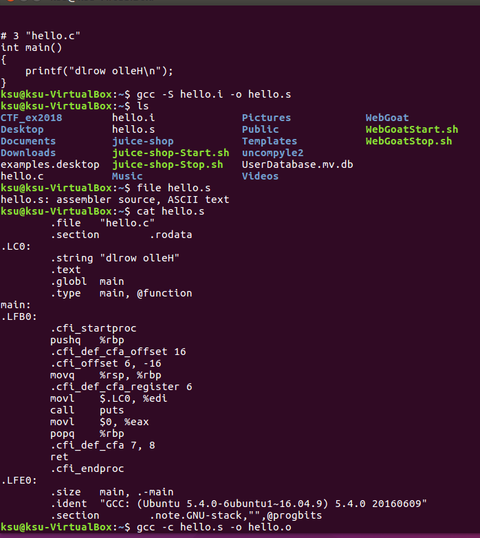
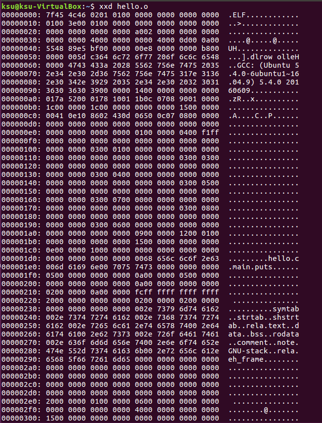

# C語言編譯&組譯

# 程式: hello.c

#include<stdio.h>
 
int main()
{

    printf("dlrow olleH\n");
    
}

# 預處理:

```
 gcc -E hello.c -o hello.i

 file hello.i
```
 ==> C source, ASCII text
 
# 編譯階段:產生組語:

gcc –S hello.i  –o hello.s



產生的組合語言(assembly)

預設是AT&T組合語言格式

	.file	"hello.c"
	.section	.rodata
.LC0:

	.string	"Hello CTFer"
	.text
	.globl	main
	.type	main, @function
main:

.LFB0:

	.cfi_startproc
	pushq	%rbp
	.cfi_def_cfa_offset 16
	.cfi_offset 6, -16
	movq	%rsp, %rbp
	.cfi_def_cfa_register 6
	movl	$.LC0, %edi
	call	puts
	movl	$0, %eax
	popq	%rbp
	.cfi_def_cfa 7, 8
	ret
	.cfi_endproc
.LFE0:

	.size	main, .-main
	.ident	"GCC: (Ubuntu 5.4.0-6ubuntu1~16.04.5) 5.4.0 20160609"
	.section	.note.GNU-stack,"",@progbits
  
 產生AT&T語法格式的組語(gcc預設使用的格式)

gcc -S -masm=att XXXXX.c -o XXXXX_att.s

產生Intel語法格式的組語(微軟預設使用的格式)

gcc -S -masm=intel XXXXX.c -o XXXXX_intel.s

要去掉一堆註解:請加上參數-fno-asynchronous-unwind-tables

gcc -S -masm=intel XXXXX.c -o XXXXX_intel_OK.s -fno-asynchronous-unwind-tables

# 編譯過程:
```
將組合語言程式碼轉成機器可以執行的指令(instructions)

每一個組語語句都對應一機器指令。

組譯器的組譯過程相對於編譯器來講比較簡單

沒有複雜的語法，也沒有語意，也不需要做指令最佳化，只是根據組語指令和機器指令的對照表一一翻譯就可以
```
```
gcc –c hello.s –o hello.o

file hello.o
```
==> hello.o: ELF 64-bit LSB relocatable, x86-64, version 1 (SYSV), not stripped

==> strings hello.o

```
dlrow olleH
GCC: (Ubuntu 5.4.0-6ubuntu1~16.04.9) 5.4.0 20160609
hello.c
main
puts
.symtab
.strtab
.shstrtab
.rela.text
.data
.bss
.rodata
.comment
.note.GNU-stack
.rela.eh_frame
```

使用xxd看看object file的內容==>xxd hello.o



# 連結過程:
```
gcc  hello.o –o hello
gcc  hello.o –o hello.exe
gcc  hello.o –o hello.jpg
```

==> "附檔名並沒有影響"
